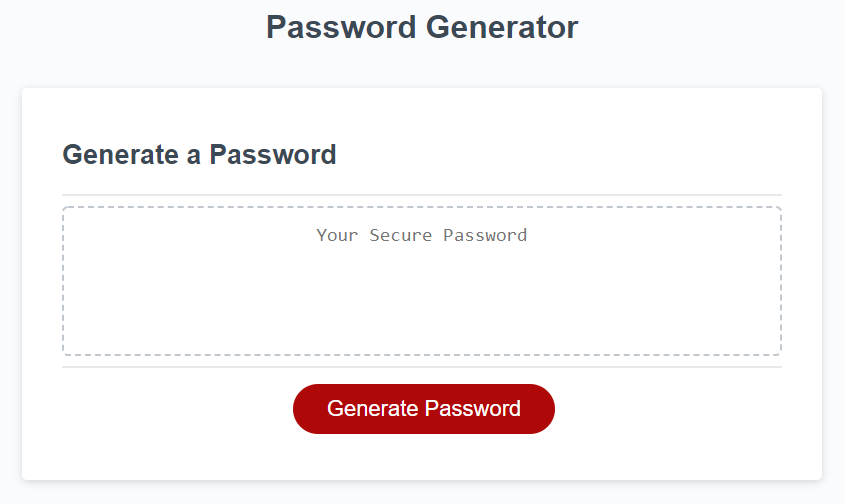

# Password Generator

## Description
Using the skillsets learned over the course of HTML, CSS, and JavaSCript to create a password generator. This application will allow employees to generate a password that meets the certain criteria needed to provide great security. 

## Acceptance Criteria
- I need a new password
- When I click the button to generate a password
- I am presented with a series of prompts for password criteria
- When I am prompted for password criteria
- I create password with the criteria needed to create the password
- When asked for the length of the password, I choose a length at least 8 characters and no more than 128 characters
- And when asked for character types to include in the password
- I confirmed to include lowercase, uppercase, numeric, and/or special characters
- After I answer each prompt
- My input should be validated and at least one character type should be selected
- Once all prompts are answered
- A password is generated that matches the selected criteria
- The password is then generated
- Then the password will either be displayed or an alert will show on the page

## Generator Screenshot

Password Generator HTML page

## Link to Deployed Attributes
 https://hjenp22.github.io/password-generatorHW3/
## About the Author
- Email: hjipark22@gmail.com
- Github: hjenp22
